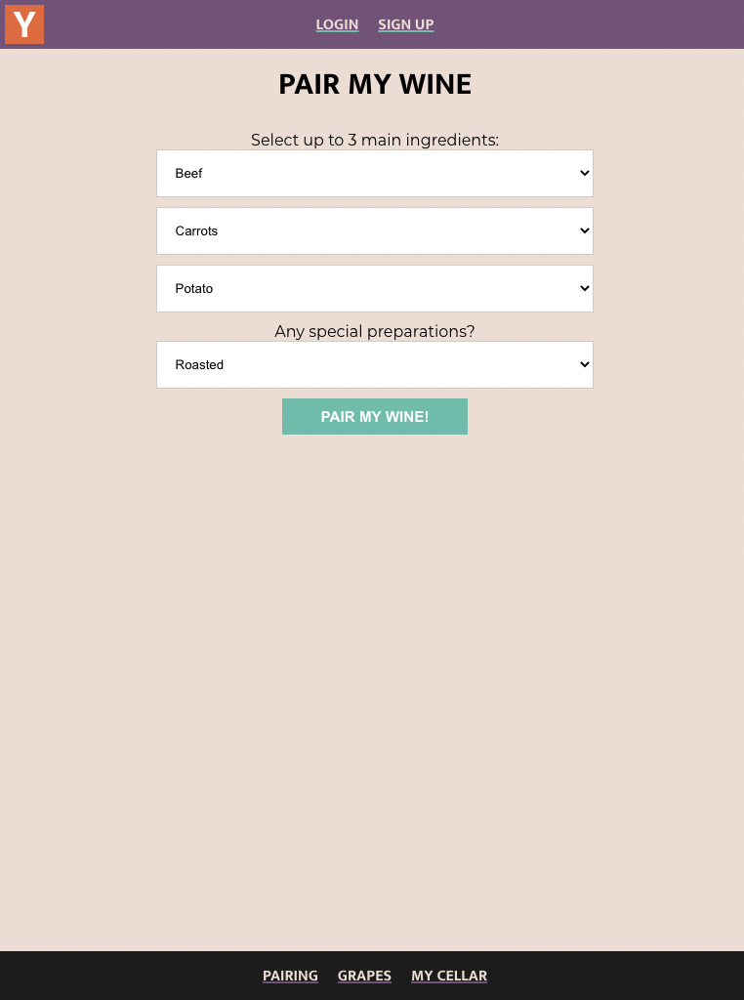
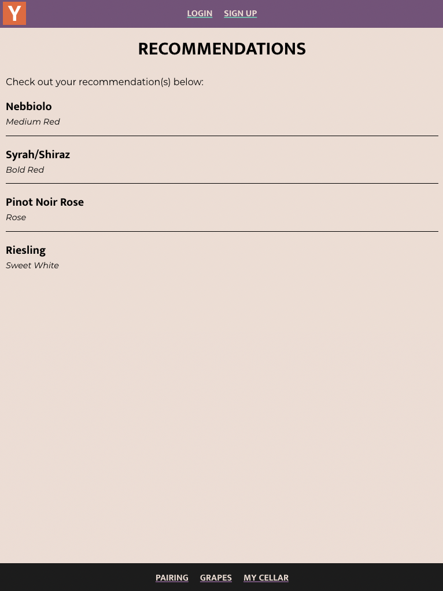
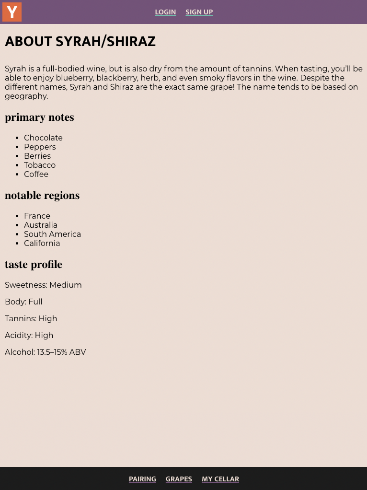

# Pair My Wine

Pair My Wine is a tool where users can generate a wine recommendation by choosing up to three ingredients and specifying a preparation method.

## Technologies used

React, Redux, NodeJS, Express, MongoDB, jsonwebtoken, bcryptjs, multer, aws-sdk

You can try the tool out live: https://pairmywine-app.netlify.app/

## The Wine Pairing Tool

Choose up to three ingredients with an option to choose a preparation method and get a wine recommendation for tonight's dinner.

Once you submit your options, you'll receive a list of recommendations you can choose from.

From there, get further details to narrow down your choice. Find out taste profiles, primary notes, and notable regions.

